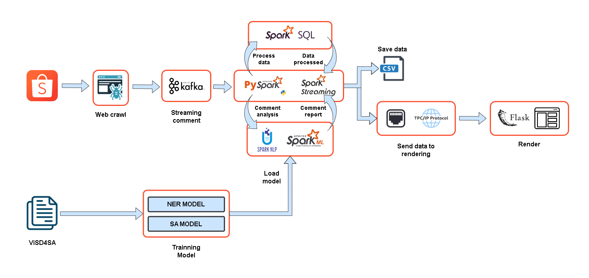
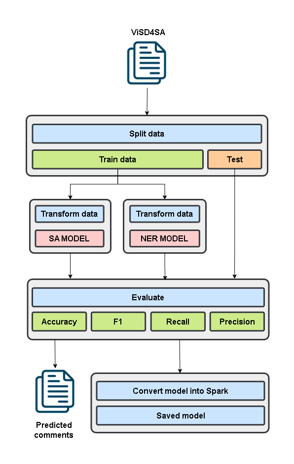
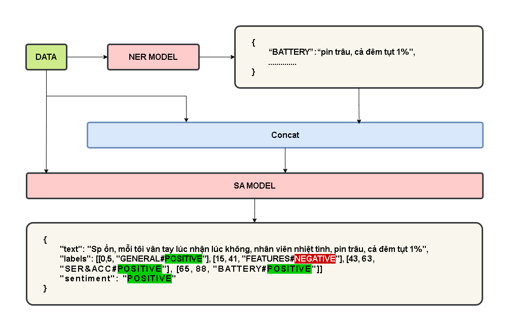

# IE212-ABSA
Xây dựng Hệ thống Phân tích Dựa trên Khía cạnh Cảm xúc (ABSA) Trực tuyến sử dụng Spark và Kafka trên Dữ liệu Bình luận từ Shopee.

- [Nguyễn Bá Đại](https://www.facebook.com/it.dainb/)   - 21521914@gm.uit.edu.vn
- [Bùi Minh Huy](https://www.facebook.com/profile.php?id=100014776896464)   - 21520910@gm.uit.edu.vn
- [Trần Ngọc Chinh](https://www.facebook.com/tnchinh.03)    - 21521892@gm.uit.edu.vn

GVHD: Đỗ Trọng Hợp - hopdt@uit.edu.vn

[**Link báo cáo**](https://drive.google.com/file/d/1EobE6_0eigrZx1jOUPNROCu3CbnRLIvR/view?usp=sharing)




## Module online


## Module offline



## Module predict



# Hướng dẫn thực nghiệm

## Bước 1: Tải mô hình
[**Link tải mô hình**](https://drive.google.com/drive/folders/1ChxaZdyyBja2ygICWN3dBMssinhuXRWA?usp=sharing)

[**Link huấn luyện mô hình**](https://drive.google.com/drive/folders/1Tz8SNwyruvdWaKygMKpO2jXxR435Z8uQ?usp=sharing)

Lưu mô hình như cấu trúc dưới

```
├── models
│   ├── NER <----- Put NER model in here
│   │   ├── fields                                  │
│   │   ├── metadata                                │
│   │   ├── .bert_classification_tensorflow.crc     │ Example
│   │   ├── bert_classification_tensorflow          │
│   ├── SA  <----- Put SA model in here
│   ├── __init__.py
├── ...
```

### NOTE FOR WINDOW

Ở mỗi loại model sẽ có file bert_classification_tensorflow.zip nếu là window do vậy hãy đổi tên file và xoá đuôi .zip

VD:

bert_classification_tensorflow.zip -> bert_classification_tensorflow

## Bước 2: Cài đặt thư viện
```bash
pip install -r requirements.txt
```

## Bước 3: Cài đặt biến

Mở file *.env* và sửa ROOT_PATH thành đường dẫn folder gốc nơi chứa foler IE212-ABSA
```.env
ROOT_PATH=C:/Downloads/IE212-ABSA
```

### NOTE

Các dấu ngăn phải là / thay vì \

## Bước 4: Chạy app
```bash
python app.py
```

## Bước 5: Chạy Producer
```bash
python producer.py
```

## Bước 6: Chạy Consumer
```bash
python consumer.py
```
